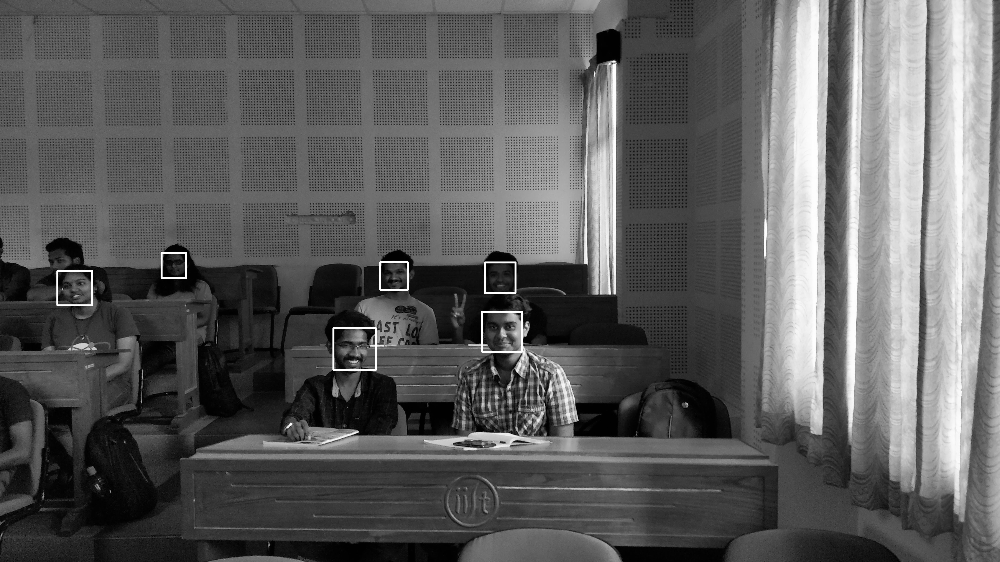
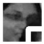

# Automatic Attendance System

In this short project for the completion of **AV493** -
**Machine Learning for Signal Processing**, we have decided
to build an **Automatic Attendance System** for the purpose of
taking attendance of a class.

## Methodology

We have decided to take a group photo, from a fixed location, in
every class, this is our sole data from which we will mark
attendance of a given student in a given class.

This is an example of data:


Now, with the use of **Haar Cascade Detectors**, we are able to get
faces as folows, for the given class as:



Also, we extract and store each face in another directory as:




As, you can see these faces are now, ready for classification. 

Next we shall implement a CNN, to which once we feed the faces the CNN classifies them
according to the training data to the required file.

## Identification

For identification we have used haar cascade classifiers in multi scale
basis implemented in open cv. The present Haar Frontal features being used are stored in 
`haarcascade_frontalface_default.xml`

The code for identification is similar to 

```
import cv2

face_cascade = cv2.CascadeClassifier('haarcascade_frontalface_default.xml')
eye_cascade = cv2.CascadeClassifier('haarcascade_eye.xml')

img = cv2.imread('img.jpg')
gray = cv2.cvtColor(img, cv2.COLOR_BGR2GRAY)

faces = face_cascade.detectMultiScale(gray, 1.3, 5)
for (x,y,w,h) in faces:
    img = cv2.rectangle(img,(x,y),(x+w,y+h),(255,0,0),2)
    roi_gray = gray[y:y+h, x:x+w]
    roi_color = img[y:y+h, x:x+w]
    eyes = eye_cascade.detectMultiScale(roi_gray)
    for (ex,ey,ew,eh) in eyes:
        cv2.rectangle(roi_color,(ex,ey),(ex+ew,ey+eh),(0,255,0),2)

cv2.imshow('img',img)
cv2.waitKey(0)
```