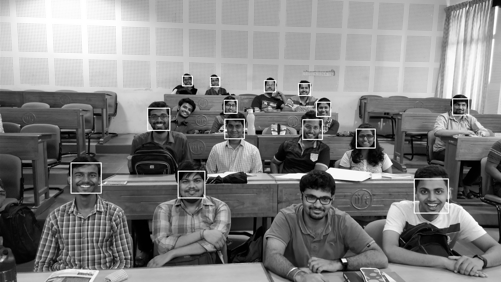

# Smart Attendance System

In this short project for the completion of **AV493** -
**Machine Learning for Signal Processing**, we have decided
to build a **Smart Attendance System** for the purpose of
taking attendance of a class.

Under guidance of [Dr. Deepak Mishra](https://www.iist.ac.in/avionics/deepak.mishra), Associate Professor, [Indian Institute of Space Science and Technology](https://iist.ac.in)

The team members include:
* [Abhinav Paul](https://www.facebook.com/abhinavpaul21121996)
* [Gandikota Rohit](https://www.facebook.com/profile.php?id=100011269818272)
* [Samvram Sahu](https://www.facebook.com/samvram)

A comprehensive presentation regarding this project can be found [here](https://gitpitch.com/samvram/SAS/master).

## Proposed Methodology

We have decided to take a group photo, from a fixed location, in
every class, this is our sole data from which we will mark
attendance of a given student in a given class.

This is an example of data:


Now, with the use of **Haar Cascade Detectors**, we are able to get
faces, for the given image the Gray image used for Haar is:



Also, we extract and store each face in another directory as:


As, you can see these faces are now extracted 

## Identification or Recognition

For classification, we need to define a training set, and we proceed by 
making our own training set(s) stored in `train` directory, a text file accompanies the images
which associates file name with a label.

However we use EigenFaces for detection and thus we must resize the images to a fixed size for 
training, and we have chosen a 60x60 size for all faces to be downsampled into.

Here are a few example photos, of the given dimension,


Now we shall proceed with **PCA** or EigenFaces for classification.

The mean face which we get can be seen as:


We subtract  average  face
μ
from  every  column  in
X
.   That  is,
x
i
:=
x
i
−
μ
,
where
x
i
is the
i
-th column of
X
.

Perform Singular Value Decomposition (SVD) on training set
X
(
X=
U
Σ
V
T
) to get
matrix
V
T
, where each row of
V
T
has the same dimension as the face image.  We refer to
v
i
,
the
i
-th row of
V
T
, as
i
-th
eigenface


Since Σ is a diagonal matrix with non-negative real numbers on
the diagonal in non-ascending order, we can use the first
r
elements in
Σ
together with first
r
columns in
U
and first
r
rows in
V
T
to approximate
X
.  That is, we can approximate
X
by
ˆ
X
r=
U
[:, :
r
]
Σ
[:
r
, :
r
]
V
T
[:
r
, :].  The matrix
ˆ
X
r
is called rank-
r
approximation of
X

Now, a logistic regression classifier is trained for  each feature vector, and its corresponding labels
The classifier is then shown a preprocessed face extracted from test image to which it responds with a 
prediction.

## Usage

The given training set consists of data from 32 images and we determine feature vectors etc from training set,
hence only recognition part has to be run daily.

* Keep the images to be marked for attendance in `test`
* Run the code `recognition.py`

## Understanding the output

The output is of the form:

```
     Attendance     

   Amal - Absent    
   Rohit - Absent   
Shubhankur - Absent 
   Sahal - Absent   
 MTech_one - Absent 
 Abhishek - Present 
 Kaninika - Absent  
   Mohit - Absent   
  Shubham - Absent  
 Himanshu - Absent  
 Abhinav - Present  
 Sanjutha - Present 
  Reuben - Present  
  Vamshi - Absent   
   Anuj - Present   
  Sairam - Absent   
  Kaninka - Absent  
 Deepsikha - Absent 
  Ujjwala - Absent  
  Divyang - Absent  
    Sam - Absent    
  Srinika - Absent  
  Ansuman - Absent  
 MTech_two - Absent 
 Debajyoti - Absent 
  Ramanan - Absent  
  Harish - Present  
  Swetha - Absent   
   Ankit - Absent   
  Pratik - Present  
  Pooja - Present   
 Niranjan - Present 
  Kalpita - Absent  
  Pragya - Present  
 Greeshma - Absent  
   Suraj - Absent   
   Neel - Present   
    PhD - Absent    
  Arnab - Present   
  Chinmay - Absent  


      Present       
      Abhishek      
      Abhinav       
      Sanjutha      
       Reuben       
        Anuj        
       Harish       
       Pratik       
       Pooja        
      Niranjan      
       Pragya       
        Neel        
       Arnab        

       Absent       
        Amal        
       Rohit        
     Shubhankur     
       Sahal        
     MTech_one      
      Kaninika      
       Mohit        
      Shubham       
      Himanshu      
       Vamshi       
       Sairam       
      Kaninka       
     Deepsikha      
      Ujjwala       
      Divyang       
        Sam         
      Srinika       
      Ansuman       
     MTech_two      
     Debajyoti      
      Ramanan       
       Swetha       
       Ankit        
      Kalpita       
      Greeshma      
       Suraj        
        PhD         
      Chinmay       

```

Here each label is given **Present** or **Absent** based on the presence in image.

There is also a tentative list of present and absent people in the list.

## Classifier comparison

We proceed to generate a comparative study of five classifiers we have used to classify the data!
In this case  study we have taken two images as our test set, which consist of few challenges for the classifers
as well.

The test images are,


The challenges posed here are uniquea and random in the sense that these have not been purposefully created,
but have been found to occur naturally!

### Challenges

* **Occlusion** - In Image 1, the first guy from right in the second last row has occluded the sight of the person behind him
* **Blur** - The above mentioned person has made motion relative to camera, and image acquired is blurred
* **Side Face** - In Image 1,the woman on the left, with in second row from first has not given the pose she gave in training images
* **Partial Occlusion** - In Image 1, the person in first row from right has been partially occluded by the person ahead
* **Partial Acquisition** - In Image 1, to limitation of camera angle, the foremost person in Image 1 is not completely in frame
* **Abnormal face** - In Image 2, the first person from left in last row has shown a face which he did not train the classifier for

Now we shall see how robust each classifier is to each of the above challenges

### Logistic Regression Classifier

Logistic regression is another technique borrowed by machine learning from the field of statistics.

It is the go-to method for binary classification problems (problems with two class values). In this post you will discover the logistic regression algorithm for machine learning.

Logistic regression is named for the function used at the core of the method, the logistic function.

The logistic function, also called the sigmoid function was developed by statisticians to describe properties of population growth in ecology, rising quickly and maxing out at the carrying capacity of the environment. It’s an S-shaped curve that can take any real-valued number and map it into a value between 0 and 1, but never exactly at those limits.

1 / (1 + e^-value)

Where e is the base of the natural logarithms (Euler’s number or the EXP() function in your spreadsheet) and value is the actual numerical value that you want to transform. 

#### Performance

```
      Present       
       Arnab        
       Pooja        
        Anuj        
      Abhinav       
      Sanjutha      
      Abhishek      
       Pragya       
       Harish       
      Niranjan      
       Reuben       
       Pratik       
        Neel  
```

* **True Positives** - 12
* **False Positives** - 0
* **False Negatives** - 3
* **Accuracy** - 80 %

Challenges tackled - **Blur**,  **Abnormal Face**

### K-Nearest Neighbours

In pattern recognition, the k-nearest neighbors algorithm (k-NN) is a non-parametric method used for classification and regression.[1] In both cases, the input consists of the k closest training examples in the feature space. The output depends on whether k-NN is used for classification or regression:

In k-NN classification, the output is a class membership. An object is classified by a majority vote of its neighbors, with the object being assigned to the class most common among its k nearest neighbors (k is a positive integer, typically small). If k = 1, then the object is simply assigned to the class of that single nearest neighbor.

In k-NN regression, the output is the property value for the object. This value is the average of the values of its k nearest neighbors.

k-NN is a type of instance-based learning, or lazy learning, where the function is only approximated locally and all computation is deferred until classification. The k-NN algorithm is among the simplest of all machine learning algorithms.

#### Performance

```
      Present       
        Arnab        
       Pooja        
        Anuj        
      Abhinav       
      Abhishek      
     MTech_one      
       Swetha       
       Harish       
      Niranjan      
      Ansuman       
       Reuben       
       Pratik       
        Neel        
      Greeshma   
```

* **True Positives** - 11
* **False Positives** - 3
* **False Negatives** - 4
* **Accuracy** - 61.11 %

Challenges tackled - **Blur**,  **Abnormal Face**, **Partial Acqusition**


### Support Vector Machines

A Support Vector Machine (SVM) is a discriminative classifier formally defined by a separating hyperplane. In other words, given labeled training data (supervised learning), the algorithm outputs an optimal hyperplane which categorizes new examples. In two dimentional space this hyperplane is a line dividing a plane in two parts where in each class lay in either side.

#### Performance

```
      Present       
     Shubhankur     
       Rohit        
      Abhinav       
      Sanjutha      
      Abhishek      
        PhD         
       Mohit        
      Kaninika      
      Kalpita       
      Himanshu      
     MTech_two      
      Shubham       
     Deepsikha      
      Divyang       
       Reuben       
      Greeshma   
```

* **True Positives** - 5
* **False Positives** - 11
* **False Negatives** - 10
* **Accuracy** - 33.33 %

Challenges tackled - **None**


### Multi Layer Perceptron(MLP) Classifier

A multilayer perceptron (MLP) is a class of feedforward artificial neural network. An MLP consists of at least three layers of nodes. Except for the input nodes, each node is a neuron that uses a nonlinear activation function. MLP utilizes a supervised learning technique called backpropagation for training. Its multiple layers and non-linear activation distinguish MLP from a linear perceptron. It can distinguish data that is not linearly separable.

Multilayer perceptrons are sometimes colloquially referred to as "vanilla" neural networks, especially when they have a single hidden layer.

#### Performance

```
      Present       
       Arnab        
       Pooja        
        Anuj        
      Srinika       
      Abhinav       
      Sanjutha      
      Abhishek      
       Pragya       
       Harish       
      Niranjan      
       Ankit        
       Reuben       
       Pratik       
        Neel  
```

* **True Positives** - 12
* **False Positives** - 2
* **False Negatives** - 2
* **Accuracy** - 75 %

Challenges tackled - **Blur**, **Abnormal Face**


### Random Forest Classifier

Random Forest Classifier is ensemble algorithm. In next one or two posts we shall explore such algorithms. Ensembled algorithms are those which combines more than one algorithms of same or different kind for classifying objects. For example, running prediction over Naive Bayes, SVM and Decision Tree and then taking vote for final consideration of class for test object.
Random forest classifier creates a set of decision trees from randomly selected subset of training set. It then aggregates the votes from different decision trees to decide the final class of the test object.
In Laymen’s term,

Suppose training set is given as : [X1, X2, X3, X4] with corresponding labels as [L1, L2, L3, L4], random forest may create three decision trees taking input of subset for example,

*    [X1, X2, X3]
*    [X1, X2, X4]
*   [X2, X3, X4]

So finally, it predicts based on the majority of votes from each of the decision trees made.

*    This works well because a single decision tree may be prone to a noise, but aggregate of many decision trees reduce the effect of noise giving more accurate results.

The subsets in different decision trees created may overlap

#### Performance

```
      Present       
       Arnab        
       Pooja        
        Anuj        
      Abhinav       
      Sanjutha      
      Abhishek      
       Pragya       
       Harish       
      Niranjan      
       Reuben       
       Pratik       
        Neel        
      Greeshma  
```

* **True Positives** - 12
* **False Positives** - 1
* **False Negatives** - 3
* **Accuracy** - 75 %

Challenges tackled - **Blur**, **Abnormal Face**

## Conclusion

Thus we have seen how a few classifiers perform against this very small set
of data, and this can be scaled up once we have a very high data-set! The
data set collected is small and not much tweaking could be done!

The classifiers oin order of their relevance is:-
* **Random Forest**'
* **Logistic Regression**
* **Multi Layer Perceptron**
* **Support Vector Machines**
* **K-Nearest Neighbours**

These classifiers are not robust to many of the challenges mentioned above
however we have managed to get a high enough accuracy to be used  which can be improved
further which we will discuss in the possible improvement section.

## Further Work

Due to lack of time and resources we conclude at an intermediate state of this work. Whoever
wishes to proceed further can take these points as a forerunner for their thought process!

* **Detection Issues** -  Due to limitation of using only **Haar Cascades** we could not get all the faces
for either training or classificaiton, this contributes to a large portion of error in these classifier studies.
* **Hyperparameter tweaking** - Owing to the lack of computation power, we could not tweak the hyperparameters of any classifier
nor did we construct a **cross-validation** set which could be of much use. The feed forward ANN on tweaking can produce
much better results.
* **Test Cases** - The number of test cases has been a very problematic factor, considering a very small data set the given statistics
which are found are non-deterministic and needs to be proven on a larger data set for verification.


## Referrences

* [Medium](https://medium.com)
* [Wikipedia](https://wikipedia.com)
* [SciKit-Learn](https://scikit-learn.org/)
* [NumPY](https://numpy.org)

We would like to thank everyone who have helped us in this endeavour and acknowledge the  help from 
professor Mishra, and all our fellow batchmates who have provided a comprehensive dataset for the project!