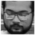
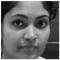

# Automatic Attendance System

In this short project for the completion of **AV493** -
**Machine Learning for Signal Processing**, we have decided
to build an **Automatic Attendance System** for the purpose of
taking attendance of a class.

## Detection

We have decided to take a group photo, from a fixed location, in
every class, this is our sole data from which we will mark
attendance of a given student in a given class.

This is an example of data:


Now, with the use of **Haar Cascade Detectors**, we are able to get
faces, for the given image the Gray image used for Haar is:


Also, we extract and store each face in another directory as:


As, you can see these faces are now extracted 

## Identification or Recognition

For classification, we need to define a training set, and we proceed by 
making our own training set(s) stored in `train` directory, a text file accompanies the images
which associates file name with a label.

However we use EigenFaces for detection and thus we must resize the images to a fixed size for 
training, and we have chosen a 60x60 size for all faces to be downsampled into.

Here are a few example photos, of the given dimension,






Now we shall proceed with **PCA** or EigenFaces for classification.

The mean face which we get can be seen as:


We subtract  average  face
μ
from  every  column  in
X
.   That  is,
x
i
:=
x
i
−
μ
,
where
x
i
is the
i
-th column of
X
.

Perform Singular Value Decomposition (SVD) on training set
X
(
X=
U
Σ
V
T
) to get
matrix
V
T
, where each row of
V
T
has the same dimension as the face image.  We refer to
v
i
,
the
i
-th row of
V
T
, as
i
-th
eigenface

The first EigenFace can be seen as:


Since Σ is a diagonal matrix with non-negative real numbers on
the diagonal in non-ascending order, we can use the first
r
elements in
Σ
together with first
r
columns in
U
and first
r
rows in
V
T
to approximate
X
.  That is, we can approximate
X
by
ˆ
X
r=
U
[:, :
r
]
Σ
[:
r
, :
r
]
V
T
[:
r
, :].  The matrix
ˆ
X
r
is called rank-
r
approximation of
X

Now, a logistic regression classifier is trained for  each feature vector, and its corresponding labels
The classifier is then shown a preprocessed face extracted from test image to which it responds with a 
prediction.

## Usage

The given training set consists of data from 32 images and we determine feature vectors etc from training set,
hence only recognition part has to be run daily.

* Keep the images to be marked for attendance in `test`
* Run the code `recognition.py`

## Understanding the output

The output is of the form:

```
     Attendance     

   Amal - Absent    
   Rohit - Absent   
Shubhankur - Absent 
   Sahal - Absent   
 MTech_one - Absent 
 Abhishek - Present 
 Kaninika - Absent  
   Mohit - Absent   
  Shubham - Absent  
 Himanshu - Absent  
 Abhinav - Present  
 Sanjutha - Present 
  Reuben - Present  
  Vamshi - Absent   
   Anuj - Present   
  Sairam - Absent   
  Kaninka - Absent  
 Deepsikha - Absent 
  Ujjwala - Absent  
  Divyang - Absent  
    Sam - Absent    
  Srinika - Absent  
  Ansuman - Absent  
 MTech_two - Absent 
 Debajyoti - Absent 
  Ramanan - Absent  
  Harish - Present  
  Swetha - Absent   
   Ankit - Absent   
  Pratik - Present  
  Pooja - Present   
 Niranjan - Present 
  Kalpita - Absent  
  Pragya - Present  
 Greeshma - Absent  
   Suraj - Absent   
   Neel - Present   
    PhD - Absent    
  Arnab - Present   
  Chinmay - Absent  


      Present       
      Abhishek      
      Abhinav       
      Sanjutha      
       Reuben       
        Anuj        
       Harish       
       Pratik       
       Pooja        
      Niranjan      
       Pragya       
        Neel        
       Arnab        

       Absent       
        Amal        
       Rohit        
     Shubhankur     
       Sahal        
     MTech_one      
      Kaninika      
       Mohit        
      Shubham       
      Himanshu      
       Vamshi       
       Sairam       
      Kaninka       
     Deepsikha      
      Ujjwala       
      Divyang       
        Sam         
      Srinika       
      Ansuman       
     MTech_two      
     Debajyoti      
      Ramanan       
       Swetha       
       Ankit        
      Kalpita       
      Greeshma      
       Suraj        
        PhD         
      Chinmay       

```

Here each label is given **Present** or **Absent** based on the presence in image.

There is also a tentative list of present and absent people in the list.

